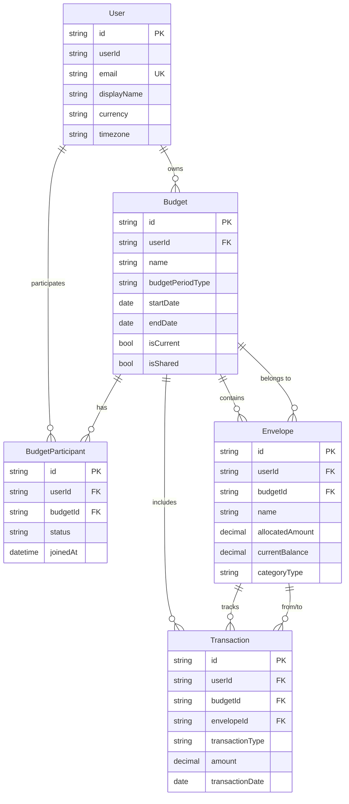

# Subtask 11: Create Comprehensive Data Model Documentation

**Parent Epic:** [EPIC: Envelope-Based Budgeting Data Model](./EPIC-envelope-budgeting-data-model.md)

## Description
Create comprehensive documentation for the envelope budgeting data model, including entity schemas, relationships, query patterns, best practices, and shared budget architecture. This documentation will serve as the primary reference for developers implementing the application layer.

## Requirements

### Documentation Structure

Create a comprehensive documentation file: `docs/DATA-MODEL-DOCUMENTATION.md`

The documentation should include:

1. **Overview**
   - Purpose and scope of the data model
   - Key concepts (envelopes, budgets, transactions)
   - Multi-user and shared budget architecture
   - Technology stack (Cosmos DB, partition strategy)

2. **Entity Schemas**
   - Detailed schema for each entity (User, Budget, Envelope, Transaction)
   - Field descriptions and data types
   - Validation rules and constraints
   - Sample JSON documents

3. **Relationships**
   - Entity relationship diagrams
   - Foreign key relationships
   - Cardinality (one-to-many, many-to-many)
   - Reference integrity rules

4. **Shared Budget Architecture**
   - How shared budgets work
   - Access control mechanism
   - Querying shared vs personal budgets
   - Data isolation considerations

5. **Partition Strategy**
   - Partition key rationale
   - Query optimization guidelines
   - Cross-partition query considerations
   - Scalability implications

6. **Indexing Policies**
   - Detailed indexing policy for each container
   - Composite index explanations
   - Excluded paths rationale
   - Performance implications

7. **Common Query Patterns**
   - SQL queries for common operations
   - RU consumption estimates
   - Optimization techniques
   - Pagination strategies

8. **Business Logic**
   - Balance calculation algorithms
   - Rollover mechanics
   - Transaction processing rules
   - Budget lifecycle management

9. **Data Integrity**
   - Consistency rules
   - Soft delete strategy
   - Voiding transactions
   - Audit trail requirements

10. **Migration and Versioning**
    - Schema versioning strategy
    - Migration approach for schema changes
    - Backward compatibility considerations

11. **Best Practices**
    - Coding guidelines for data access
    - Error handling patterns
    - Performance optimization tips
    - Security considerations

### Additional Documentation Files

Create supporting documentation:

1. **docs/QUERY-PATTERNS-REFERENCE.md**
   - Complete query library
   - Indexed by use case
   - Performance benchmarks
   - Example code (C#, JavaScript)

2. **docs/SHARED-BUDGET-GUIDE.md**
   - Detailed guide for shared budgets
   - Implementation patterns
   - Access control examples
   - Common scenarios (household budgets, couples, roommates)

3. **infrastructure/arm-templates/cosmos-database/CONTAINERS-REFERENCE.md**
   - Quick reference for all containers
   - Partition keys
   - Index policies
   - Configuration parameters

### Entity Relationship Diagram

Create a visual ERD showing:
- User → Budgets (one-to-many)
- User → Shared Budgets (many-to-many via BudgetParticipants)
- Budget → Envelopes (one-to-many)
- Envelope → Transactions (one-to-many)
- Transaction → Envelope relationships (for transfers)

Format: Mermaid diagram embedded in markdown

### Sample Code Examples

Include code examples for:

#### C# SDK Examples
```csharp
// Creating a user
// Creating a budget
// Creating an envelope
// Recording a transaction
// Querying transactions by envelope
// Calculating envelope balance
// Handling shared budgets
```

#### JavaScript/TypeScript SDK Examples
```typescript
// Same operations in TypeScript
// Using Azure Cosmos DB SDK for JavaScript
```

### Query Performance Guide

Document expected RU consumption for:
- All common queries
- Aggregations
- Cross-partition queries
- Pagination scenarios

### Shared Budget Implementation

Document the shared budget model:

#### BudgetParticipants Schema
```json
{
  "id": "bp-guid",
  "userId": "user-guid",
  "budgetId": "budget-guid",
  "role": "member",
  "joinedAt": "2026-02-15T10:00:00Z",
  "invitedBy": "owner-user-guid",
  "status": "active"
}
```

#### Shared Budget Queries
- Get all budgets for a user (personal + shared)
- Get all participants for a budget
- Check if user has access to a budget

### Data Model Decision Log

Document key decisions:
- Why `/userId` partition key
- Why multiple containers vs single container
- Why exclude description/notes from indexing
- Shared budget architecture approach
- TTL strategy for transactions

### Migration Guide

Document migration scenarios:
- Adding new fields to existing entities
- Changing partition keys (not possible, workaround)
- Adding new containers
- Schema version upgrades

## Deliverables
- [ ] Main data model documentation created (`docs/DATA-MODEL-DOCUMENTATION.md`)
- [ ] Query patterns reference created (`docs/QUERY-PATTERNS-REFERENCE.md`)
- [ ] Shared budget guide created (`docs/SHARED-BUDGET-GUIDE.md`)
- [ ] Containers reference created (`infrastructure/arm-templates/cosmos-database/CONTAINERS-REFERENCE.md`)
- [ ] Entity relationship diagram included (Mermaid)
- [ ] Code examples for C# included
- [ ] Code examples for JavaScript/TypeScript included
- [ ] Query performance benchmarks documented
- [ ] Business logic algorithms documented
- [ ] Best practices guide included
- [ ] Migration guide included
- [ ] README.md updated with links to new documentation

## Documentation Quality Standards

### Completeness
- All entities fully documented
- All relationships explained
- All queries have examples
- All business rules covered

### Clarity
- Clear, concise language
- Visual diagrams where helpful
- Code examples are working and tested
- Technical terms defined

### Accuracy
- Schema matches ARM templates
- Queries are tested and validated
- RU estimates based on actual testing
- Examples use realistic data

### Maintainability
- Versioned (v1.0)
- Table of contents for navigation
- Cross-references between documents
- Change log section

## Sample ERD (Mermaid)



## Sample Documentation Sections

### User Entity Documentation Template
```markdown
## User Entity

### Description
Stores user profile information, preferences, and settings.

### Container
`users` (partition key: `/userId`)

### Schema
| Field | Type | Required | Description | Default |
|-------|------|----------|-------------|---------|
| id | string (GUID) | Yes | Unique user identifier | - |
| userId | string (GUID) | Yes | Same as id (partition key) | - |
...

### Validation Rules
- Email must be unique across all users
- Currency must be valid ISO 4217 code
...

### Sample Document
[JSON example]

### Common Queries
[Query examples with RU estimates]
```

## Acceptance Criteria
- All entities completely documented with schemas, examples, and queries
- Shared budget architecture clearly explained with examples
- Entity relationship diagram accurately represents all relationships
- Query patterns cover all common operations with RU estimates
- Code examples provided for C# and JavaScript/TypeScript
- Best practices guide is comprehensive and actionable
- Migration guide covers common scenarios
- Documentation is well-organized with clear navigation
- All technical decisions are explained with rationale
- Documents are reviewed for accuracy and completeness
- Cross-references between documents work correctly
- README.md updated with links to all new documentation

## Testing Checklist
- [ ] All JSON examples validate against actual schema
- [ ] All SQL queries tested in Azure Data Explorer
- [ ] All code examples compile and run
- [ ] RU estimates verified through testing
- [ ] ERD accurately reflects entity relationships
- [ ] All links and cross-references work
- [ ] Documentation reviewed by peer
- [ ] Spelling and grammar checked
- [ ] Technical accuracy validated
- [ ] Examples use realistic, consistent data

## Documentation Tools

### Recommended Tools
- **Markdown Editor**: Visual Studio Code with Markdown Preview
- **Diagram Tool**: Mermaid (for ERD)
- **JSON Validator**: jsonlint.com or VS Code JSON extension
- **SQL Validator**: Azure Cosmos DB Data Explorer
- **Spell Check**: VS Code spell checker extension

### Formatting Standards
- Use GitHub-flavored Markdown
- Code blocks with language identifiers
- Tables for structured data
- Consistent heading levels
- Numbered lists for procedures
- Bullet lists for features/options

## Technical Accuracy Validation

Ensure documentation matches:
- ARM template configurations (Subtasks 6-9)
- Data model schemas (Subtasks 1-4)
- Container architecture (Subtask 5)
- Deployment scripts (Subtask 10)

## Cross-References

Link to related documentation:
- Azure Cosmos DB best practices
- PowerShell deployment guide
- Infrastructure architecture
- Security and compliance docs
- Monitoring and observability

## Version Control

Documentation versioning:
- Version 1.0: Initial release
- Include change log section
- Date documentation updates
- Tag breaking changes clearly

## Dependencies
- Subtask 1: User Data Model
- Subtask 2: Budget Data Model
- Subtask 3: Envelope Data Model
- Subtask 4: Transaction Data Model
- Subtask 5: Container Architecture
- Subtasks 6-9: Container Infrastructure
- Subtask 10: Deployment Scripts
- Existing documentation standards

## Related Files
- `docs/DATA-MODEL-DOCUMENTATION.md` (new)
- `docs/QUERY-PATTERNS-REFERENCE.md` (new)
- `docs/SHARED-BUDGET-GUIDE.md` (new)
- `infrastructure/arm-templates/cosmos-database/CONTAINERS-REFERENCE.md` (new)
- `README.md` (update with links)

## Estimated Effort
- Main data model documentation: 4 hours
- Query patterns reference: 3 hours
- Shared budget guide: 2 hours
- Containers reference: 1 hour
- Entity relationship diagram: 1 hour
- Code examples (C#): 2 hours
- Code examples (JavaScript): 2 hours
- Review and validation: 2 hours
- Cross-linking and final editing: 1 hour
- **Total**: 18 hours
